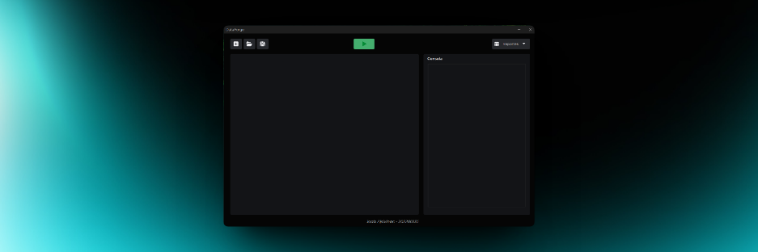
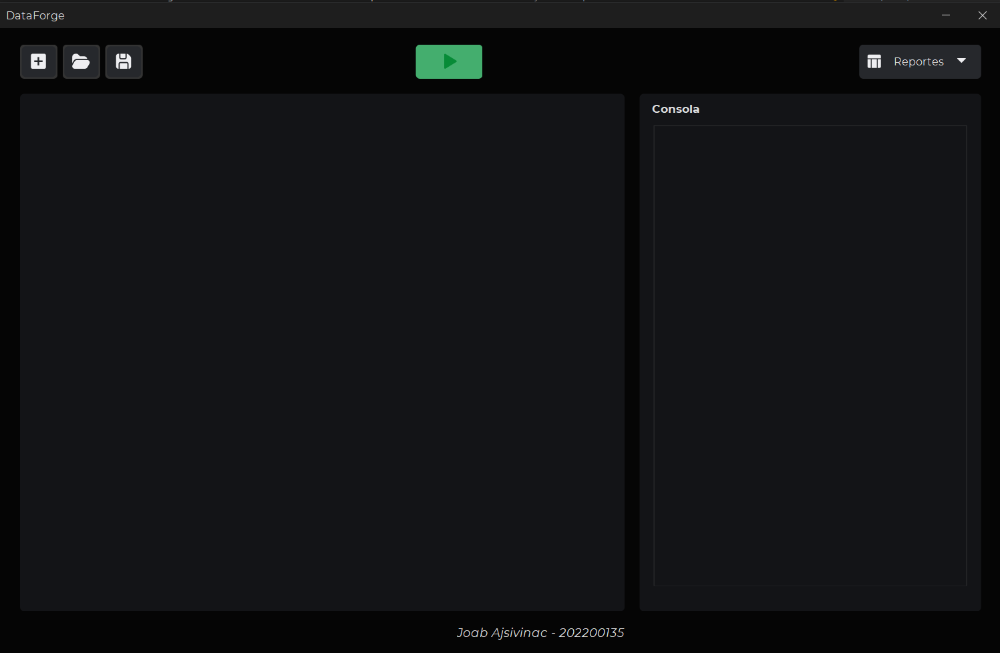
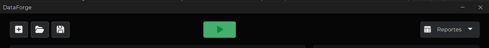
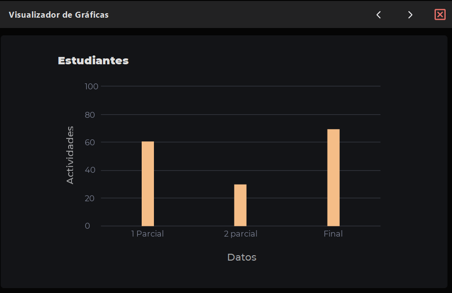
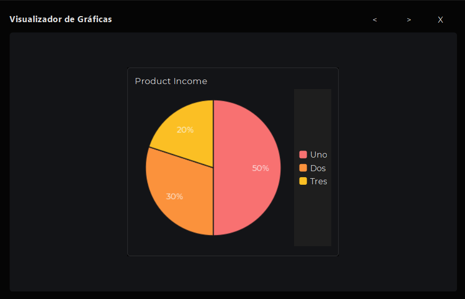
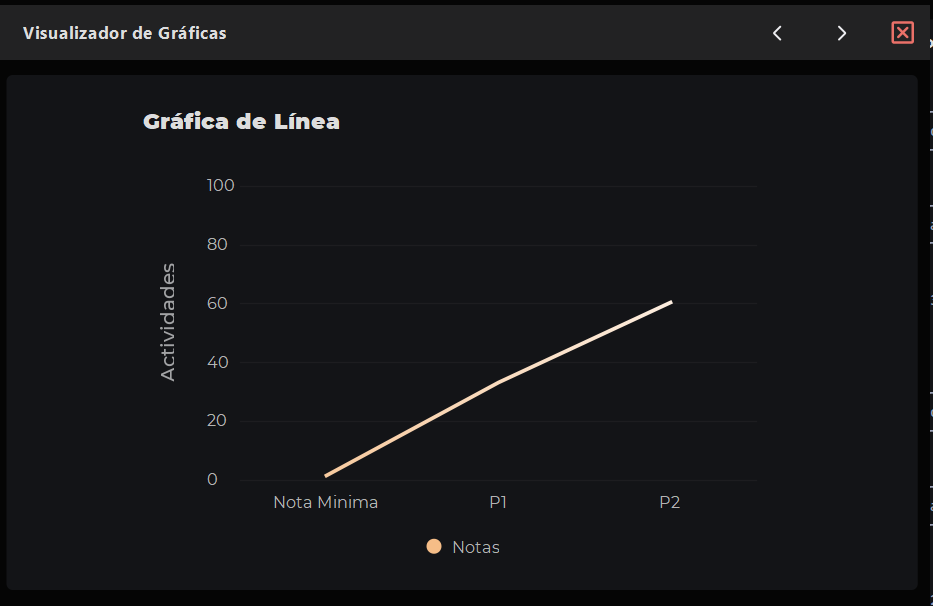
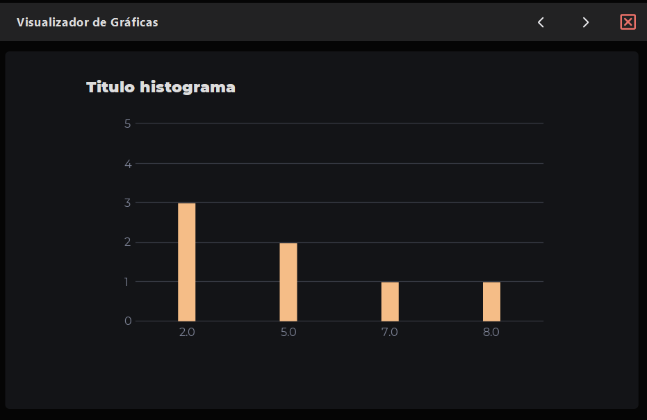

<h1 align="center">Proyecto 1</h1>
<p align="center">
    <a href="#"></a>
</p>
<p align="center"></p>

<div align="center">
🙍‍♂️ Joab Israel Ajsivinac Ajsivinac 🆔 202200135
</div>
<div align="center">
📕 Organización de Lenguajes y Compiladores 1
</div>
<div align="center"> 🏛 Universidad San Carlos de Guatemala</div>
<div align="center"> 📆 Primer Semestre 2024</div>


# ⚽ Objetivos
* **Objetivo General**
    *Aplicar los conocimientos sobre la fase de análisis léxico y sintáctico de un compilador para la construcción de una solución de software
* **Objetivos Específicos**.
    * Aprender a genera analizadores léxicos y sintácticos utilizando JFLEX y CUP
    * aprender los conceptos de token, lexema, patrones y
expresiones regulares.
    * realizar correctamente el manejo de errores
léxicos.
    * realizar acciones gramaticales
utilizando el lenguaje de programación JAVA.


# 📍 Manual de Usuario

## ⚒ Requerimientos
<ul>
<li>Sistemas Opreativos</li>
    <ul>
        <li>Windows 8 o Superior</li>
        <li>macOS Catalina o Superior</li>
        <li>Linux: Ubuntu, Debian, CentOS, Fedora, etc.</li>
    </ul>
    <li>Java 19 o Superior</li>
    <li>NetBeans 20 o superior</li>
    <li>Librerías</li>
    <ul>
        <li>FlatLaf 3.0</li>
        <li>flatlaf-intellij-themes-3.0</li>
        <li>jflex-full 1.7.0</li>
        <li>java-cup 11b</li>
        <li>java-cup 11b-runtime</li>
    </ul>
</ul>


## 📟 Instalación
Descargue el código o bien clone el repositorio en una carpeta.

Si se opta por la clonación se hace con la siguiente linea de código en terminal (Antes de ejecutar el codigo asegurese de estar en la carpeta donde lo quiere descargar)

```bash
git clone https://github.com/J-Ajsivinac/OLC1_Proyecto1_202200135.git
```

## ⚡ Inicio Rápido
Una vez teniendo el programa, abra el proyecto con Netbeans, y dirijase al paquete proyecto y abra `Proyecto1.java` y luego presione `F6` o de click para ejecutar.

> [!NOTE]  
> Existen archivos de prueba en la carpeta llamada test

## 💻 Interfaz de Usuario y Funcionalidades
Al ejecutar el proyecto se le mostrara la siguiente ventana

<p align="center">
    <a href="#"></a>
</p>

El programa consta de 2 partes principales, las cuales son:

### Parte superior

<p align="center">
    <a href="#"></a>
</p>

En esta parte se pueden realizar las siguientes acciones

> **Sección Izquierda (Manejo de archivos)**
> En la parte izquierda podra visualizar 3 botones, los cuales están encargados de Agregar una nueva pestaña, Abrir un archivo con extensión `.df` y guardar, esto le permitira interactuar con el panel que esta debajo de esta sección


>  **Sección Media (Ejecución del analisis)**
> En la parte media, se puede visualizar un botón verde, el cual al presionarlo enviara el código escrito para su análisis

>  **Sección Derecha (Reportes)**
> En la parte derecha puede visualizar un botón el cual al presionarlo se desplegará un menú, en el cual podrá seleccionar 3 tipos de reportes:
> * Reporte de Tokens: muestra los tokens reconocidos por el analizador léxico
> * Reporte de Errores: muestra los errores léxicos y sintácticos encontrados durante el analisis.
> * Reporte de Tabla de símbolos: muestra todas las variables y arreglos declarados

**Nota**: Todos los reportes son generados con extensión `.html`

### Parte media

En esta parte derecha se puede agregar el codigo ha analizar, y en la parte izquierda se podra visualizar las impresiones en consola generadas por el codigo escrito previamente analizado.

En la parte donde se agrega el codigo, es necesario, agregar una pestaña o bien abrir un archivo, para poder acceder al cuadro de texto donde se escribira el codigo.

Las instrucciones:
```
console::print = “hola”, numero, 15, “adios” end;
console::column = “Enteros” -> @darray end;
Histogram(
    titulo::char[] = “Analisis de Arreglo” end;
    values::char[] = [2,2,2,5,5,7,8] end;
    EXEC Histogram end;
) end;
```

Muestran una salida en consola

-----

El programa tambien cuenta con la opción de generar las siguientes gráficas:
* Barras
<p align="center">
    <a href="#"></a>
</p>

* Pie
<p align="center">
    <a href="#"></a>
</p>

* Línea
<p align="center">
    <a href="#"></a>
</p>

* Histograma
<p align="center">
    <a href="#"></a>
</p>


# 📍 Manual Técnico

## ⚙ Tecnologías Utilizadas

<div align="center" style="display:flex;justify-content:center;gap:20px">
 <a href="https://skillicons.dev">
    
  </a>
</div>
<ul>
  <li>Java</li>
  <li>Visual Studio Code</li>
  <li>Git</li>
  <li>Html</li>
  <li>NetBeans</li>
  <li>tailwindcss</li>
  </ul>
</ul>

## 🧮 Como funciona

La aplicación consta de 2 partes importantes el `backend` y el `frontend`

<h3>Backend</h3>

Dentro de la carpeta backend se tiene el archivo principal que maneja el servidor, el cual es el main.go. Dicho archivo contiene las rutas a las cuales se llaman para poder interactuar con el backend desde el frontend.

**Rutas**

* Login: Valida las credenciales enviadas a través de un JSON, si coincide con un usuario entra a su respectiva pagina, si no coincide retorna un error

* obtener-tlibros: Obtiene todos los libros que están cargados en el sistema

* **ADMINISTRADOR**: Las siguientes rutas están precedidas de la palabra admin, por ejemplo. 'admin/cargar-e'
  * /carcar-e: Es el encargado de subir los archivos que contienen a los estudiantes.
  * /obtener-e: Se encarga de obtener a los estudiantes y devolverlos en forma de arreglo.
  * /cargar-t: carga a los tutores dado el archivo .csv que se envie
  * /cargar-c: carga los cursos dado el archivo .json que se envie
  * /aceptar-libro: cambia el estado del libro seleccionado según la acción del administrador
  * /crear-arbol: crea el arbol de merkle con los libros aceptados o rechazados por el administrador.

* **TUTOR**: Las siguientes rutas están precedidas de la palabra tutor, por ejemplo: 'tutor/agregar-arbolB' 
  * /agregar-arbolB: Agrega un libro a un tutor
  * /obtener-libros: Obtiene los libros de un tutor
  * /agregar-contenido: Agrega una publicación a un tutor
  * /obtener-publicacioens: Obtiene las publicaciones de un tutor
* **ESTUDIANTE**: las siguientes rutas están precedidas de la palabra estudiantes, por ejemplo 'estudiante/buscar-libros'
  * /buscar-libros: busca libros por codigo de estudiante sin tomar en cuenta el estado
  * /buscar-estudiante: busca a un estudiante registrado
  * /buscar-libros-aceptados: busca los libros que están aceptados

<br />

**Estructuras Usadas**
___

> **Árbol B**
> 
> Estructura de datos en forma de árbol, diseñado para facilitar la búsqueda, inserción y eliminación eficiente de datos, fue usada para el almacenamiento de los `Tutores` facilitando la inserción de libros y publicaciones.
>
> Para las ramas se cuenta con una estructura auxiliar la cual se encarga de agregar las diferentes ramas, dicha estructura se encuentara en **ramaB** el cual solo cuenta con el método insertar
> * Insertar: Se encarga de iunsertar un nuevo nodo en la posición adecuada dentro de la estructura arbolB, manteniendo el orden.
>
> Entrando en el archivo arbolB.go
> Aqui se encuentra los diferentes métodos que hacen funcionar al arbol B
> * **insertar_rama**: Se encarga de insertar un nodo en una rama especifica del arbol B
```go
 func (a *ArbolB) insertar_rama(nodo *NodoB, rama *RamaB) *NodoB {
	// verificar si la rama es hoja
	if rama.Hoja {
		// Inserta el nodo y verifica si hay que dividirlo
	} else {
		temp := rama.Primero
		// Itera las ramas hasta que temp sea nulo
		for temp != nil {
			// verifica si el curso ya esta registrado
			if nodo.Usuario.Curso == temp.Usuario.Curso {
				return nil
			// verifica el valor del curso para su inserción
			} else if nodo.Usuario.Curso < temp.Usuario.Curso {
			
			// Si el siguiente es nulo se inserta y se valida si se tiene que dividir segpún el orden de la rama, si no se cumple nada de lo anterior se retorna nulo
			} else if temp.Siguiente == nil {

			}
			temp = temp.Siguiente
		}
	}
	return nil
}
```
> * **dividir** : Se encarga de dibidir una rama en dos, devolviendo un nuevo nodo que contiene el valor medio y las ramas resultantes izquierda y derecha.
> * **Insertar** : Realiza la inserción de un nuevo nodo en el arbol B
> * **Graficar**: Se encarga de generar un gráfico del árbol B
> * **grafo**: recibe un nodo de la rama y genera el código DOT para representar el grafo del árbol
> * **grafoRamas**: Recibe un nodo de la rama y genera el código DOT para representar cada rama.
> * **conexionRamas**: Recibe un nodo de la rama y genera el cógio DOT para representar las conexiones entre las ramas
> * **Buscar**: Busca un elemento con un número en el árbol B y almacen los resultados en una lista simple
> * **buscarArbol**: Recibe un nodo de la rama y realiza una búsqueda
> * **LeerCSV**: Función que lee el csv para luego insertar los datos en el arbol B
> * **GuardarLibro**: Busca el usuario según carnet para agregar un libro en el arreglo de libros
> * **CambiarEstadoLibro**: Busca a un usuario según carnet para luego iterar por los libros que tiene el usuario para finalmente cambiar el estado del libro enviado por parametros
> * **GuardarPublicacion**: Busca a un estudiante por carnet para agregar una publicación al arreglo de publicaciones
> * **encriptarPassword**: Encripta una contraseña con Sha256.

> **Árbol de Merkle**
> 
> Estructura de datos en forma de árbol binario, fue usada para el almacenamiento de los libros aceptados y/o rechazados
>
> * fechaActual: Obtiene la fecha del sistema y lo convierte a un formato entendible el cual es: `DD-MM-YYYY::HH:MM:SS`
>
> * **AgregarBloque**: Tiene el propósito de agregar un nuevo bloque de datos a la estructura validando si ya se tiene al menos un bloque de datos, para iterar a través de los bloques existentes
> * **GenerarArbol**: Completa el árbol de merkle hasta que tenga un número de bloques que sea una potencia de 2, y luego generar los hashes correspondientes 
> * **crearArbol** : Realiza la inserción de un nuevo nodo en el arbol B
> * **generarHash**: Genera el árbol de Merkle a partir de los bloques de datos existentes en la estructura y establece la raiz del árbol, esot usando un bucle que recorre todos los bloques.
> * **encriptarSha3**: Encripta una cadena utilizando el algoritmo de hash SHA-3(Secure Hash Algorithm) y devuelve la representación hash resultante. 
> * **Graficar**: Genera un gráfico del árbol de Merkle y retorna, declarando variables locales para los nombres y construyendo la estructura del código DOT para la generación del gráfico.
> * **retornarValoresArbol**: Método auxiliar que ayuda a la construccion del contendio del gráfico, se encarga de construir nodos en las cadena con información de la raíz y sus referencias si existen.

> **Grafo**
> 
> Estructura de datos utilizada para describir las relaciones entre vértices en un grafo. Cada vértice del grafo tiene una lista que enumera todos los vértices adyacentes a él, usada en el almacenamiento de los cursos.
>
> * **insertarColumna**: Agrega un nuevo nodo al grafo representado como un aestructura de lista de adyacencia. Dependiendo de si el curso coincide con el nodo principal del grafo o no, se inserta el nnodo como adyacente.
> * **insertarFila**: Añadae una nueva fila la grafo con el valor del curso, verifica si el nodo es el principal para asignar el valor como corresponde
> * **InsertarValores** : Llama a las funciones anteirores para agregar un nuevo nodo con los valroes del curos y post al grafo, y valida si el nodo principal del grafo está vació antes de su inserción
> * **Graficar**: Genera una representación gráfica del grafo en formato DOT para su visualización
> * **retornarValoresMatriz**: Retorna una cadena de texto que representa las conexiones entre los nodos del grafo
> * **Lectura**: Lee un archivo JSON enviado, deserializa el JSON y utiliza la información para insertar valores y construir el grafo
> * **retornarValoresArbol**: Busca un curso específico en el grafo retornando un valor booleano

> **Tabla Hash**
> 
> Estructura de datos que asocia claves con valores. usada para mapear datos a ubicaciones especificas en la tabla, usada para el almacenamiento de los estudiantes debido a su eficiencia a la hora de hacer busquedas 
>
> * **calculoIndice**: Convierte el número de carnet en un índice aplicando un algoritmo que involucra la sumna de los códigos ASCII de los digitos del carnet.
> * **insertarFila**: Verifica si la utilización de la tabla supera el 70% de sus capacidad para hacer los ajustes necesarios
> * **nuevaCapacidad** : Calcula una nueva capacidad para la tabla utilizando la secuencia de Fibonacci
> * **reInsertar**: Reorganiza la tabla después de cambiar la capcidad, reinsertando nodos en nuevos índices
> * **reCalculoIndice**: Realiza un nuevo cálculo de indice para resolver coliciones mediante sondaje cuadrático
> * **nuevoIndice**: Ajusta el índice si es necesario para evitar desbordamiento.
> * **Insertar**: Inserta un nuevo nodo en la tabla hash, manejando colisiones mediante sondaje cuadrático.
> * **BuscarUsuario**: Busca un usuario en la tabla hash según su número de carnet.
> * **LeerCSVFromReader**: Lee datos desde un archivo CSV utilizando un lector CSV, encripta las contraseñas y luego inserta los registros en la tabla has

### Frontend

Para la interacción con el servidor se tiene la carpeta api, el cual contiene las peticiones que se hacen a la api

* export const graphRequest : llama a la función para crear las gráficas

* export const finishRequest : crea el arbol de merkle para su posterior graficacion
 
* export const addBookRequest: agrega un nuevo libro a un tutor

* export const searchBookRequest: Busca libros para mostrarlos en pantalla

* export const addPubsRequest: asocia una publicación a un tutor

* export const getBooksRequest: Obtiene todos los libros que estan guardados sin importar el curso o tutor

* export const acceptBookRequest: Acepta o rechaza los libros para que la api cambie el estado del libro

* export const getCoursesRequest: Obtiene los cursos asignados de un estudiante

* export const getBooksStudentsRequest: Obtiene los libros de los cursos a los que esta asignado un estudiantes

* export const getBooksAStudentsRequest: Obtiene los libros aceptados de los cursos a los que esta asignado un estudiantes

<br/>

El frontend esta dividido en dos partes Las paginas y los componentes.

En las paginas se tiene lo siguiente:

* AcceptBooks: Pagina donde se aceptan o rechazan los libros cargados por los tutores, mediante una llamada a la API 
* Courses: Pagina donde se ven los cursos a los que los estudiantes estan asignados
* CreatePub: Pagina donde los tutores se crean las publicaciones 
* LoadCourses: Pagina donde se carga el JSON de los cursos
* LoadStutents: Pagina donde se cargan a los estudiantes 
* LoadTutor: Pagina donde se cargan a los tutores
* Login: Pagina donde se valida las credenciales para poder ser redirigido a las paginas correctas
* Pubs: Pagina donde se ven las publicación por curso de los tutores
* Report: Pagina donde se visualizan los reportes dependiendo del tipo de reporte que se elija
* StudentBooks: Pagian dodnde los estudiantes ven los libros aceptados por curso
* TutorBooks. Pagina donde se agregan los libros de parte de los tutores

En los componentes se tiene lo siguiente:
* Cards: Los componentes que llevan Card en sus nombres, contienen contenedores para los diferentes aspectos de las webs
* ContainerMain: Componente que contiene a los demás componentes es el contenedor principal
* Items: son componentes partes de una listas, junto con sus estilos
* Modals: Componentes que se muestran al presionar un botón y se muestran como ventanas emergentes
* NavBar: Componentes de navegación principal para poder movilizarse a una pagina u otra 
* SelectInput: Componente que hace la tarea du un input de tipo select pero con estilos personalizados
* Tagas: Componentes que muestra un numero o estado dependiendo del tipo de tag

## 📷 Capturas de los Reportes

<p align="center">Grafica del grafo de adyacencia/p>


<p align="center">Gráfica del arbol de Merkle</p>


<p align="center">Gráfica del arbol B</p>
****