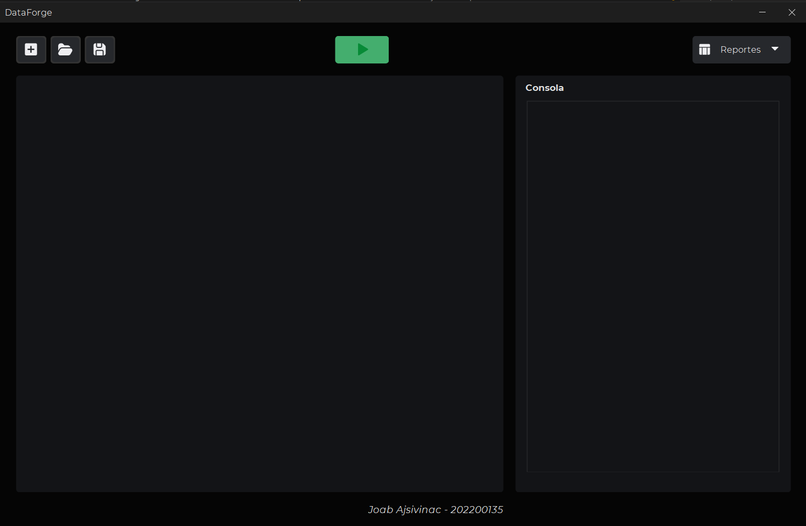
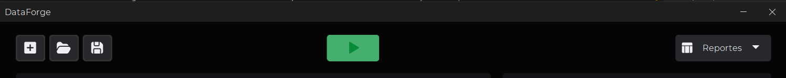
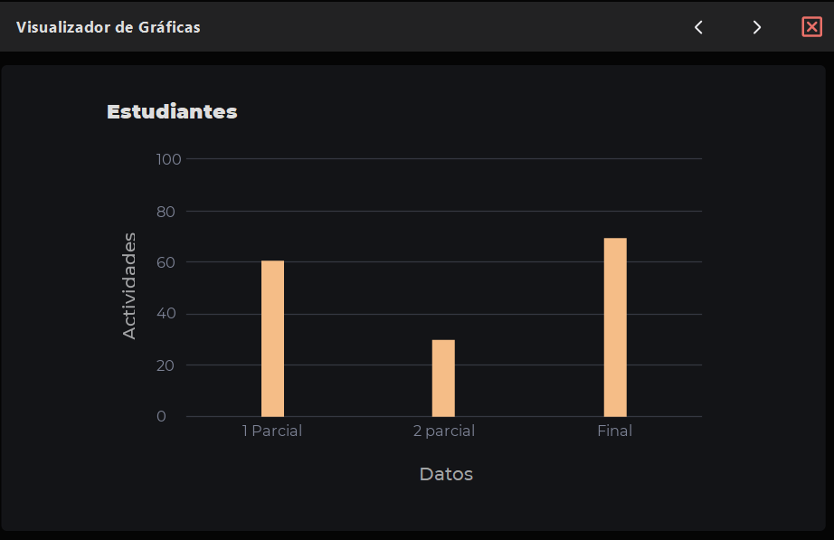
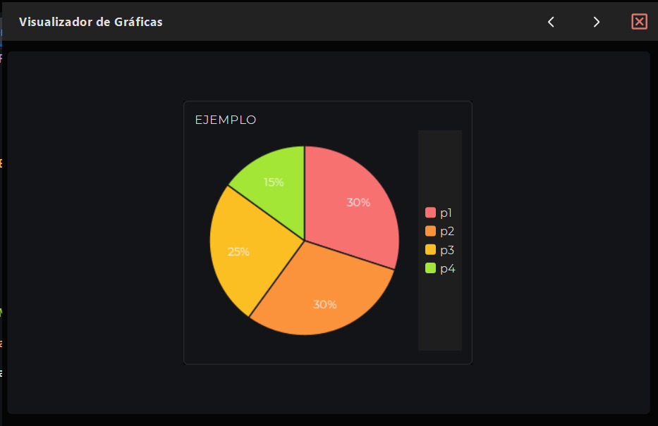
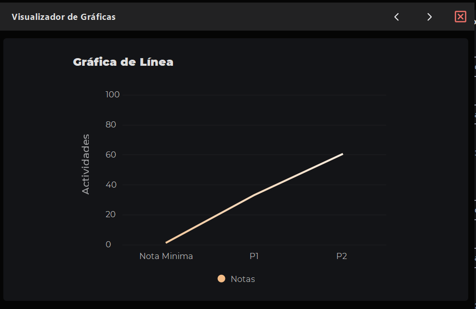
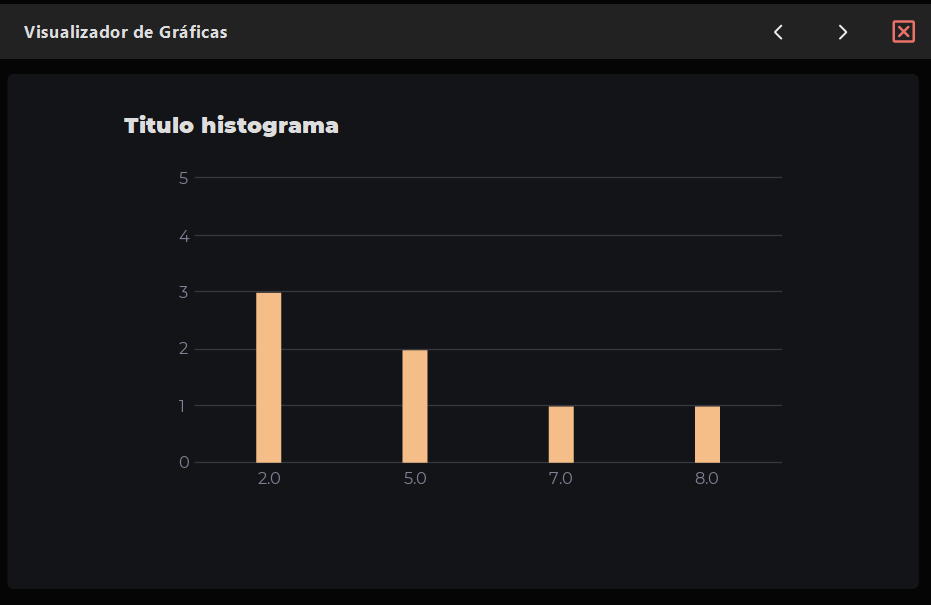

<h1 align="center">Proyecto 1</h1>
<p align="center">
    <a href="#"></a>
</p>
<p align="center"></p>

<div align="center">
🙍‍♂️ Joab Israel Ajsivinac Ajsivinac 🆔 202200135
</div>
<div align="center">
📕 Organización de Lenguajes y Compiladores 1
</div>
<div align="center"> 🏛 Universidad San Carlos de Guatemala</div>
<div align="center"> 📆 Primer Semestre 2024</div>


# ⚽ Objetivos
* **Objetivo General**
    *Aplicar los conocimientos sobre la fase de análisis léxico y sintáctico de un compilador para la construcción de una solución de software
* **Objetivos Específicos**.
    * Aprender a genera analizadores léxicos y sintácticos utilizando JFLEX y CUP
    * aprender los conceptos de token, lexema, patrones y
expresiones regulares.
    * realizar correctamente el manejo de errores
léxicos.
    * realizar acciones gramaticales
utilizando el lenguaje de programación JAVA.

<br/> 

<h1 align="center">📍 Manual de Usuario</h1>

<br/> 

## ⚒ Requerimientos
<ul>
<li>Sistemas Opreativos</li>
    <ul>
        <li>Windows 8 o Superior</li>
        <li>macOS Catalina o Superior</li>
        <li>Linux: Ubuntu, Debian, CentOS, Fedora, etc.</li>
    </ul>
    <li>Java 19 o Superior</li>
    <li>NetBeans 20 o superior</li>
    <li>Librerías</li>
    <ul>
        <li>FlatLaf 3.0</li>
        <li>flatlaf-intellij-themes-3.0</li>
        <li>jflex-full 1.7.0</li>
        <li>java-cup 11b</li>
        <li>java-cup 11b-runtime</li>
    </ul>
</ul>


## 📟 Instalación
Descargue el código o bien clone el repositorio en una carpeta.

Si se opta por la clonación se hace con la siguiente linea de código en terminal (Antes de ejecutar el codigo asegurese de estar en la carpeta donde lo quiere descargar)

```bash
git clone https://github.com/J-Ajsivinac/OLC1_Proyecto1_202200135.git
```

## ⚡ Inicio Rápido
Una vez teniendo el programa, abra el proyecto con Netbeans, y dirijase al paquete proyecto y abra `Proyecto1.java` y luego presione `F6` o de click para ejecutar.

<!-- > [!NOTE]  
> Existen archivos de prueba en la carpeta llamada test -->

## 💻 Interfaz de Usuario y Funcionalidades
Al ejecutar el proyecto se le mostrara la siguiente ventana

<p align="center">
    <a href="#"></a>
</p>

El programa consta de 2 partes principales, las cuales son:

### Parte superior

<p align="center">
    <a href="#"></a>
</p>

En esta parte se pueden realizar las siguientes acciones

> **Sección Izquierda (Manejo de archivos)**
> En la parte izquierda podra visualizar 3 botones, los cuales están encargados de Agregar una nueva pestaña, Abrir un archivo con extensión `.df` y guardar, esto le permitira interactuar con el panel que esta debajo de esta sección


>  **Sección Media (Ejecución del analisis)**
> En la parte media, se puede visualizar un botón verde, el cual al presionarlo enviara el código escrito para su análisis

>  **Sección Derecha (Reportes)**
> En la parte derecha puede visualizar un botón el cual al presionarlo se desplegará un menú, en el cual podrá seleccionar 3 tipos de reportes:
> * Reporte de Tokens: muestra los tokens reconocidos por el analizador léxico
> * Reporte de Errores: muestra los errores léxicos y sintácticos encontrados durante el analisis.
> * Reporte de Tabla de símbolos: muestra todas las variables y arreglos declarados

**Nota**: Todos los reportes son generados con extensión `.html`

### Parte media

En esta parte derecha se puede agregar el codigo ha analizar, y en la parte izquierda se podra visualizar las impresiones en consola generadas por el codigo escrito previamente analizado.

En la parte donde se agrega el codigo, es necesario, agregar una pestaña o bien abrir un archivo, para poder acceder al cuadro de texto donde se escribira el codigo.

Las instrucciones:
```
console::print = “hola”, numero, 15, “adios” end;
console::column = “Enteros” -> @darray end;
Histogram(
    titulo::char[] = “Analisis de Arreglo” end;
    values::char[] = [2,2,2,5,5,7,8] end;
    EXEC Histogram end;
) end;
```

Muestran una salida en consola

-----

El programa tambien cuenta con la opción de generar las siguientes gráficas:

* **Barras**
<p align="center">
    <a href="#"></a>
</p>

La gráfica de barras cuenta con la siguiente sintaxis:

```
graphBar(
    titulo::char[] = "Estudiantes" end;
    ejeX::char[] = ["1 Parcial", "2 parcial", "Final"] end;
    ejeY::double = [50, 30, 70] end;
    tituloX::char[] = "Actividades" end;
    tituloY::char[] = "Notas" end;
    EXEC graphBar end;
) end;
```

* **Pie**
<p align="center">
    <a href="#"></a>
</p>

La gráfica de Pie cuenta con la siguiente sintaxis:

```
graphLine(
    titulo::char[] = "Gráfica de Línea" end;
    ejeX::char[] = ["1 Parcial", "2 parcial", "Final"] end;
    ejeY::double = [50, 30, 70] end;
    tituloX::char[] = "Actividades" end;
    tituloY::char[] = "Notas" end;
    EXEC graphLine end;
) end;
```

* **Línea**
<p align="center">
    <a href="#"></a>
</p>

```
graphLine(
    titulo::char[] = "Gráfica de Línea" end;
    ejeX::char[] = ["1 Parcial", "2 parcial", "Final"] end;
    ejeY::double = [50, 30, 70] end;
    tituloX::char[] = "Actividades" end;
    tituloY::char[] = "Notas" end;
    EXEC graphLine end;
) end;

```

* **Histograma**
<p align="center">
    <a href="#"></a>
</p>

La gráfica de barras cuenta con la siguiente sintaxis:

```
Histogram(
    titulo::char[] = "Analisis de Arreglo" end;
    values::char[] = [2,2,2,5,5,7,8] end;
    EXEC Histogram end;
) end;
```

### Reportes

Como se indico anteriormente el programa cuenta con la capacidad de realizar reportes en formato `.html`, los cuales se guardan en la carpeta raiz del proyecto, en una carpeta llamda `Reports`, ahi encontrará los archivos con sus respectivos nombres.

**reporte_tokens.html**

<p align="center">
    <a href="#"></a>
</p>

**reporte_errores.html**

<p align="center">
    <a href="#"></a>
</p>

**reporte_tabla.html**

<p align="center">
    <a href="#"></a>
</p>
